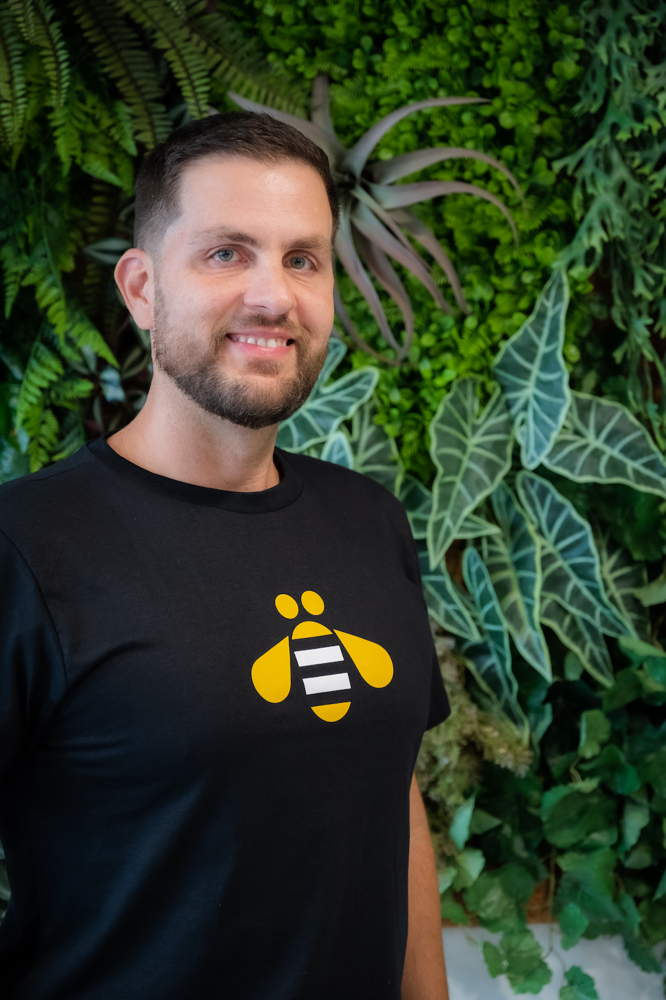

<!-- 
_paginate: false
_footer: "[original email thread](https://bit.ly/2Jfg7Zb)"
_class:  -->

> Typically, this has involved helping large companies make the transition to open source but we've also worked with companies on what we call
> **"inner sourcing"** -- that is, helping them to 
> **use open source development techniques within the corporation**, or with a cluster of key customers -- 
> even if they aren't ready to take the step all the way to releasing their software as a public open source project.

_Tim O'Reilly (2000)_

---

<!-- Scoped style -->

## InnerSource

> é o uso das melhores  **práticas de desenvolvimento** e o estabelecimento de uma  **cultura** semelhante ao __OpenSource__ dentro das organizações para o desenvolvimento de software de código não aberto e/ou proprietário.

__Alan Braz (2022)__

<!--
InnerSource is a software development methodology that applies the lessons learned from decades of open source software development to the concerns of tech leads and developers working inside proprietary organizations. In this introductory level course, InnerSource experts Danese Cooper and Russell Rutledge draw on their own experiences at companies like PayPal, Nike, and more to describe how InnerSource methods solve real world issues. How do I get teams located in far flung locations, possibly speaking different languages, and using different tools to work together effectively? How do I teach teams to contribute code without disrupting each other's workflow? How can I encourage developers in one business unit to incorporate functionality in their products using features developed by a competing business unit? These are just a few of the concerns InnerSource can address. By the end of this course, you'll have a firm understanding of InnerSource's key practices (collaboration, transparency, and mentorship) and a solid grasp of how you can use them to transform your own team from average to excellent.
-->
---

##### Piggybacking InnerSource on to Agile and DevOps

Mishari Muqbil (Zymple) - IS Summit 21 Part 2

---

<!-- _class: -->

### The Open Organization

#### Igniting Passion and Performance

Jim Whitehurst

ex-CIO Red Hat, ex-presidente IBM

---

<!-- backgroundImage: "linear-gradient(to top right, #012d9c, #031f67)" -->

## OpenSource

- Código-livre?
- Repositório público?
- Fork, code, commit, push, PR, merge
- Comunidade! 
    - [opensource.guide](https://opensource.guide)
    - [opensource.org](http://opensource.org)
    - [www.ibm.com/opensource](http://www.ibm.com/opensource)

---

<!-- 
backgroundImage: 
_class: invert
_header: ""
_footer: ""
_paginate: false
-->

---

<!-- 
backgroundImage: 
_class:  -->

| OpenSource | InnerSource|
| --- | --- | 
| Múltiplas empresas contribuem para o bem da comunidade | Times ou divisões contribuem para o bem da empresa |
|  |  |
| Author, Owner, Maintainers/Committer, Contributors, Community Members |  Product Owner, Trusted Committer, Contributors/Guests, Users |

---

<!-- _class: -->

#### Papéis

[fonte: noise.getoto.net/tag/innersource](https://noise.getoto.net/tag/innersource/)

---

### Vantagens

\+ Qualidade, Colaboração, Reuso

\- Gargálos, Silos, Frustração

= Inovação!

= Atração de novas gerações

---

<!-- backgroundImage: "linear-gradient(to top right, #012d9c, #031f67)" -->

### Desafios

- Ferramentas - GitHub, GitLab...
- Automação - CI/CD, testes
- Transparência - descoberta, acesso
- Comunicação - documentação, feedback
- Vergonha - pressão spcial, qualidade
- Propriedade intelectual - especial
- Contrato com cliente

https://resources.github.com/innersource/fundamentals/
<!--

<!-- 
_backgroundImage: "linear-gradient(to top right, #0b4d02, #06423d)" 

## Alan Braz

- Profissional
    - 20 anos em desenvolvimento web
    - 17 anos de IBM: Consultoria e Pesquisa
- Estudante
    - Ba Ciência da Comp. 2005 Unicamp
    - Ms Eng. da Software 2013 Unicamp
- Pessoa
    - casado, 2 filhos (6,6), yorkshire, porquinho da india
    - musculação, taekwondo, corrida, basquete 
    
-->

---

# InnerSource@IBM

---

<!-- _backgroundColor: black -->
<!-- _backgroundImage: "" -->

### Social Coding - IBM Garage Methodology

> As equipes podem contribuir para projetos 
> além de seu escopo e os desenvolvedores podem 
> colaborar para construir e melhorar o código do software. 
[practice_social_coding](https://www.ibm.com/garage/method/practices/culture/practice_social_coding/) [tool_github](https://www.ibm.com/garage/method/practices/code/tool_github/)

---

### Birth of InnerSource at IBM

Olivia Buzek (IBM) - IS Summit 21 Part 1

--- 

#### InnerSource a an Experience

- IaaE é uma abordagem sistemática de reuso através da adoção de ferramentas e práticas padronizadas com o objetivo de maximizar o impacto otimizando a  colaboração e co-desenvolvimento da Comunidade.

---

#### Princípios

- Consistência
    - padronizar para escalar
- Repetibilidade
    - processos e infraestrutura 
- Reuse
    - remover tensão entre times
- Comunidade
    - cultura colaborativa

---

#### Papéis da comunidade

- Exploradores
    - novos contribuidores, usuários, participantes da Comunidade
- Contribuidores
    - promovem melhorias, membros da Comunidade
- Trusted Committers
    - Especialistas, promotores da Comunidade
- Starters
    - iniciam o projeto, artefatos, ferramentas, código, criadores da Comunidade

--- 

<!-- 
_class: 
_backgroundImage: 
-->

### Ferramentas

- GitHub Enterprise, ZenHub
- GitHub pages
- Travis CI, Tekton
- OpenShift clusters
- Artifactory
- Slack, Mural
- Webex, Box, Sharepoint

---

<!-- 
_header: ""
_footer: "" 
-->

---

<!-- 
_class: 
_backgroundImage: 
-->

## Obrigado!

[innersourcecommons.org](https://innersourcecommons.org/)

[Artigo InfoQ](https://www.infoq.com/articles/inner-source-open-source-development-practices/)

[Playlist no YT](https://www.youtube.com/playlist?list=PLsO2m5gtfktKNX8zflJB0T5KbTSclCqnr)

Podcast:
[pullrecast.dev](http://pullrecast.dev)

